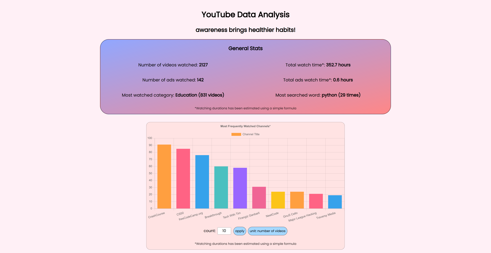
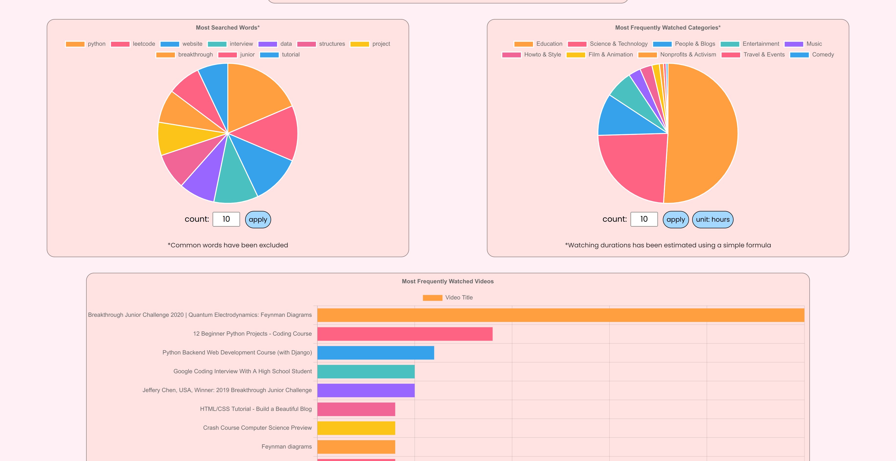

# YouTube Data Analysis
## awareness brings healthier habits!
Authors: Barisha Namazov, Firangiz Ganbarli, Zoe Kulphongpatana

Easily see key and fun facts about your data just in seconds! Follow the steps:

0. Make sure you have Python 3.9 or higher (sorry about that, but it's time to update).
1. Go to [Google Takeout](https://takeout.google.com/settings/takeout) and only select "Youtube and Youtube Music" (at the end). You can use "Deselect All" button at the top of the list to make this easier.
2. Once you choose "Youtube and Youtube Music," click on "Multiple Formats" button under it, and change the format for `History` from `HTML` to `JSON` and close that setting. Now, click on "All Youtube data included" button and only choose the following values: `history`, `subscriptions`.
3. Obtain a [Google Developer API Key for Youtube data](https://developers.google.com/youtube/v3/getting-started).
4. Clone this repository, and put the files (you will need to take them out of their own folders) you got under `data` folder. Either create a file named `.env` in the root directory of this repo and add `API_KEY=XXX` (where `XXX` is your API key you got from the previous step) or manually set `API_KEY` variable in the file `yt/YTCrawler.py`.
5. Run `pip install -r requirements.txt` to install Python dependencies. Then run `server.py` file to start a local web server for your statistics. It might take a little while to start if your data is large. Note that to not do a lot of API requests, the data is cached and put into file named `cache.pickle` in the project root. **If you change your data contents, you need to remove cache.pickle file to update the statistics.**
6. Enjoy and reflect!

### a bit of technical details, for the curious
This project has minimal dependencies! The front-end is implemented using [Chart.js](https://www.chartjs.org/), really whacky JavaScript and a little of quick CSS. The back-end uses the services under `yt/`. `YTParser` class parses and cleans the data from Google Takeout files, and `YTCrawler` does the API requests to get additional data about some parts. `Aggregrator` puts everything together (which is why it got messier after a while) to provide functionality for the webserver. The webserver is implemented without any framework, just using a built-in WSG interface. I think the coolest part about this app is it's caching functionality. After you do all API requests, it will cache everything and put in a pickle file, so everytime you run it, your cache file will be used instead. That means it's super easy to add more functionality and have the server run really quick.

